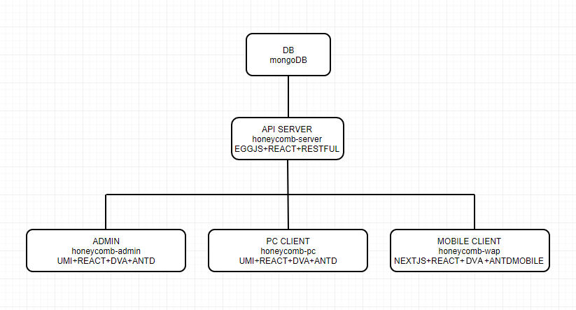

### 1、系统架构图

### 2、子应用

#### 2.1、[honeycomb-server](https://github.com/guanweisong/honeycomb-server)

> 通过mongoose操作mongoDB，对外提供restful形式的api接口。在模块设计上与[Wordpress](https://wordpress.org/)模块结构类似。

技术栈：

* [React](https://reactjs.org/)
* [Egg.js](https://eggjs.org/)

MODEL划分：

* `category`：文章分类
* `comment`：用户评论
* `link`：友情链接
* `media`：媒体中心
* `page`：页面
* `post`：文章
* `setting`：设置
* `tag`：标签
* `user`：用户
* `token`：token

安全防护：
* 所有接口使用节流中间件
* 关键接口使用行为验证码拦截，例如登陆接口，用户发表评论接口等
* 用户权限采用JWT签名验证
* HTTP接口传输采用SSL加密

#### 2.2、[honeycomb-admin](https://github.com/guanweisong/honeycomb-admin)

> 通过[honeycomb-server](https://github.com/guanweisong/honeycomb-server)提供的restful api实现的SPA网站管理平台。

技术栈：

* [React](https://reactjs.org/)
* [UmiJS](https://umijs.org/)
* [DvaJs](https://dvajs.com/)
* [AntD](https://ant.design/)

#### 2.3、[honeycomb-pc](https://github.com/guanweisong/honeycomb-pc)

> 通过[honeycomb-server](https://github.com/guanweisong/honeycomb-server)提供的restful api实现的网站桌面端SPA应用

技术栈：

* [React](https://reactjs.org/)
* [UmiJS](https://umijs.org/)
* [DvaJs](https://dvajs.com/)
* [AntD](https://ant.design/)

#### 2.4、[honeycomb-wap](https://github.com/guanweisong/honeycomb-wap)

> 通过[honeycomb-server](https://github.com/guanweisong/honeycomb-server)提供的restful api实现的移动端H5同构应用

技术栈：

* [React](https://reactjs.org/)
* [Next.js](https://nextjs.org/)
* [MobX](https://mobx.js.org/)
* [Ant Design Mobile](https://mobile.ant.design)

